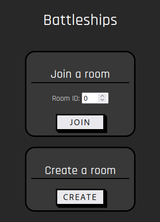
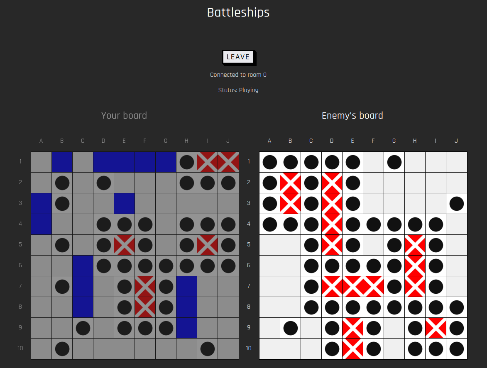

# Battleships



# Setup
```bash
bun install
```

# Build

# Run
To run the server in watch mode: 
```bash
bun run watch
```
   
To watch-compile the frontend scripts: 
```bash
bun run watch-static
```

# To do
* state machine 
* ships
